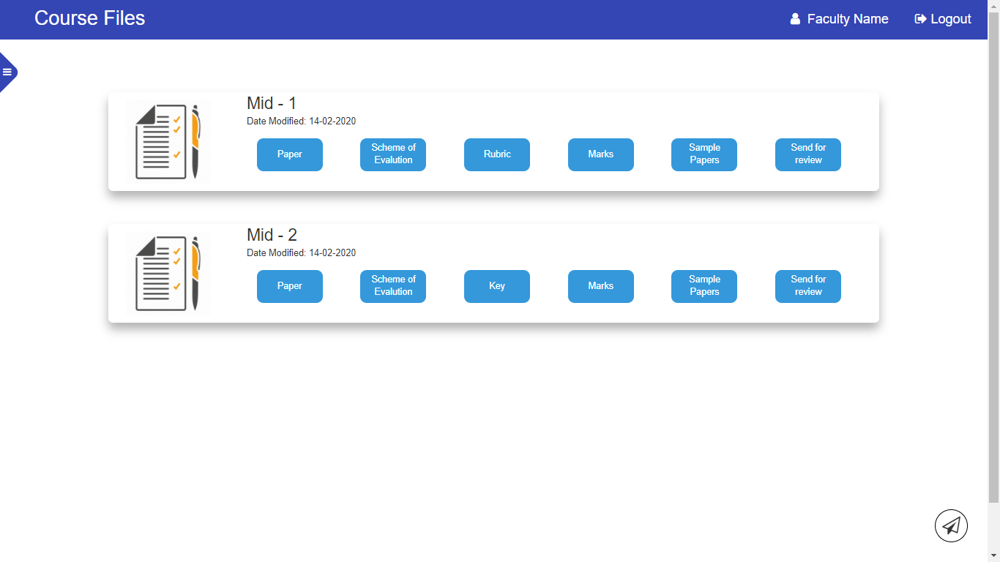

# Course File Management System
This course files project is designed purely for faculty to maintain the records of lesson plan, timetable, assignment, mid paper, rubrics, remedial classes, tutorial classes.                      
This course plan helps the faculty to make the course plan online and helps to store the course details without the fear of losing the documents.

course files System is a one stop solution for all the course file systems. This system’s access is granted only to the Administrator and Faculty and provides the users a very friendly user interface.

Administrator’s functionalities are to add faculty, map faculty to subject, view upload status of all faculty, map faculty to review the question paper, update database.

Faculty’s functionalities are to upload the assignment question paper, mid question paper, review paper, tutorial, and to fill the details of the remedial classes, rubrics, roleplay, open book test.

This System is a replacement to the existing Course files System, so as to reduce paper-work and to avoid the loss of data. This system can be accessed by all the intended users, all the time based on the Network Availability through a desktop computer or personal mobile device.

Faculty have to upload the required documents and fill the details. The proposed system helps the management in taking actions regarding issues faced by the faculty in the institution quicker. This system ensures both security and maintainability. This System has scope to make changes easily, because it has been developed by using the feature of Modularity.

## Features
* Administrator or Faculty has the ability to Login.
* Admin can export Faculty Details.
* Admin can Map Subject to a Faculty Member.
* Admin has the ability to update the Database.
* Admin has the ability to modify the Mapping of Faculty.
* Admin or Faculty can view Course plan details.
* Admin and Faculty have the ability to Change Password.
* Faculty must upload the timetable, mid question paper, mid answer scripts, assessment paper, and fill the details of remedial classes, tutorial classes, rubrics.

## Getting Started

Below link is the implemented version of the entire project.
Link Removed

### Prerequisites

Your system must be installed with xampp/wampp server running with Apache and MySQL servers.

### Installing

If you want to deploy this project in you machine, import the courseplan.sql file into mysql. Change the database name in db.php.
Otherwise, you can test the implemented model( Link Removed ).

## Running the tests

<h3 align="center">Faculty</h3>

### Home Page (Login Page)

* You can login as Faculty/Admin from this page.
* If you forgot your password, you can change it by clicking "Forgot Password" option below the Login button.

### Courses

* After login, this is the course selection page for faculty.
* In this, first you have to select the acedamic year.
* Then the courses that the faculty teaching/tought will appear here.
* Now, select any course of your choice.

### Faculty Course Dashboard

* From this page, you can view the status of the review of your course file.
* You can change your password from this page.

### Upload Page

* In this page, you can upload the files like images, audio, video, text files, etc.
* Uploading of php files is not allowed.

### Open File

* You can view, update, rename and delete a file.

### Mid papers

* In this page, you can upload paper, scheme of evalution, key, marks, sample papers.
* You can send the mid paper for review by other faculty who are teaching the same subject.

### Assignments

* In this page, you can upload CO Attainment, Bloom's Taxonomy, Rubric, Marks.

### Question Paper

* In this page, you can create your own question paper.

### Rubric

* Creation of rubric for the assignment and mid papers are possible from this page.

### Quiz

* In this page, you can add the quiz links of moodle.

### Remedial Classes

* You can maintain the remedial classes data.

### Content Beyond Syllabus

* The data of any extra topics that were explained to students can be maintained here.

### Review

* You can review the mid papers that others sent to you here.

### Reviewer

* We can review the mid papers that others sent to you.
* You should enter the question no, co, po, matched(yes/no).

### Roleplay List

* The roleplay list that you have created will be displayed here.
* You can create a new roleplay by entering a name for roleplay and click New roleplay button.

### Tutorial Classes

* You can enter the data of tutorial classes cunducted here.

## Built With

* HTML
* CSS
* BootStrap
* JavaScript
* jQuery
* php
* MySQL

## Authors

* **S.Dinesh**
* **V.Jahnavi**
* **R.Vivekananda**
* **T.Chandra Mouli**
* **Sheema Patro**
* **P.Rushitha**
* **S.Pushpa Moulika**
* **S.Aakanksha**
* **S.Gnana Sri**
* **O.Sandeep**
* **V.Sateesh**
* **D.Yogini**
* **S.Karthik**

